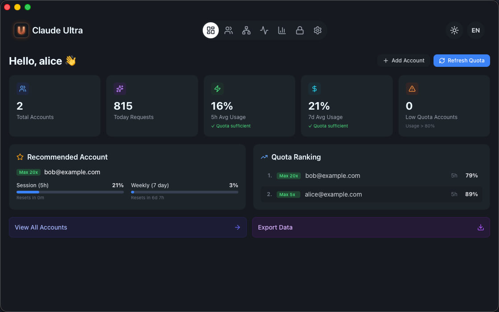
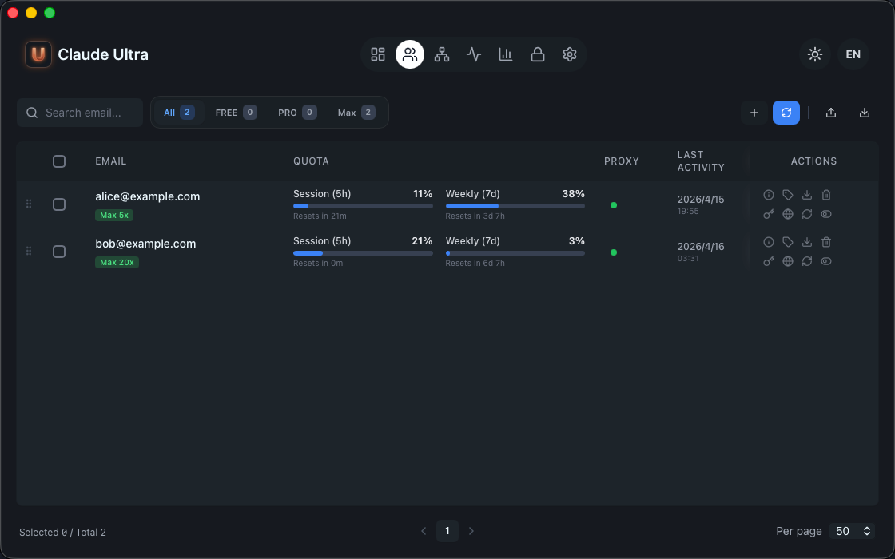
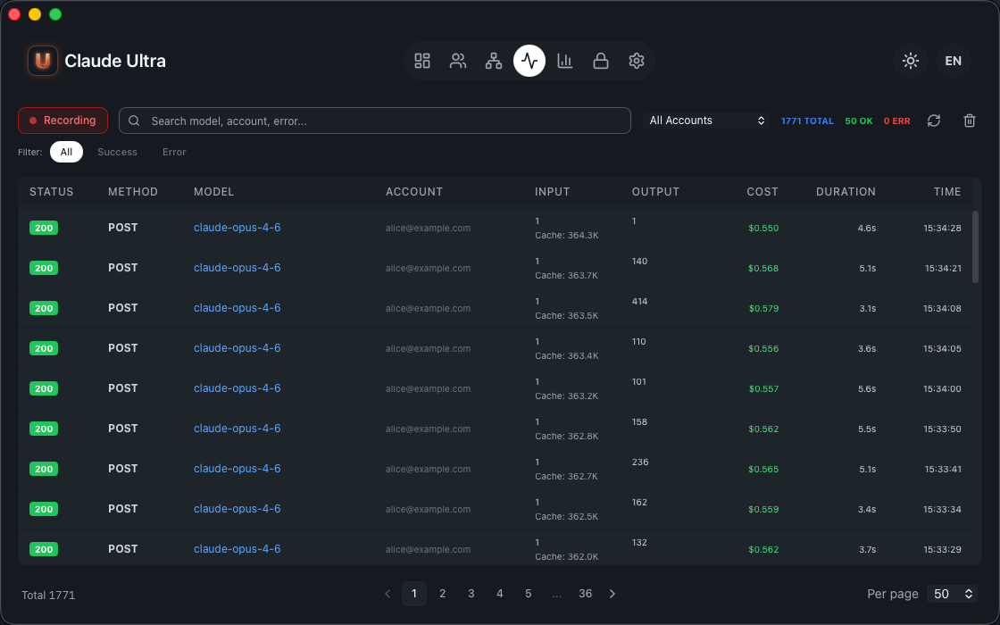

<h1 align="center">Claude Ultra</h1>

<p align="center">
  <em>Multi-account manager for Claude Code — local API gateway with automatic account rotation.</em>
</p>

<p align="center">
  <a href="https://github.com/hatawong/claude-ultra/releases"></a>
  <a href="https://github.com/hatawong/claude-ultra/blob/main/LICENSE"></a>
  <a href="https://github.com/hatawong/claude-ultra/stargazers"></a>
  <a href="https://github.com/hatawong/claude-ultra/issues"></a>
  
  
</p>

<p align="center">
  <strong>English</strong> | <a href="README_zh.md">中文</a>
</p>

<p align="center">
  
</p>

---

## What is Claude Ultra

Claude Ultra is a macOS desktop app that manages multiple Claude Code accounts through a local API gateway. Configure Claude Code to use `localhost` as the API endpoint, and Claude Ultra handles everything: account selection, quota tracking, automatic failover, and residential proxy rotation.

## Features

| Feature | Description |
|---------|-------------|
| **Local API Gateway** | Transparent HTTP proxy on `localhost:9000` — Claude Code connects as if talking to `api.anthropic.com` |
| **Multi-Account Pool** | Add multiple Claude accounts, auto-rotate based on quota availability |
| **Quota Monitoring** | Real-time session (5h) and weekly (7d) usage tracking per account |
| **Automatic Failover** | Request fails on one account? Seamlessly retries on the next available one |
| **Residential Proxy** | IPRoyal proxy pool with per-session sticky IPs and automatic rotation ([setup guide](docs/proxy-setup.md)) |
| **Traffic Logs** | Full request/response logging with model, tokens, cost, and latency |
| **GitHub Login** | Device flow authentication via GitHub OAuth |
| **Subscription Tiers** | Free / Pro / Max / Ultra with different concurrent account limits |
| **12 Languages** | English, 简体中文, 繁體中文, 日本語, 한국어, العربية, Español, Português, Русский, Türkçe, Tiếng Việt, Bahasa Melayu |

<p align="center">
  
</p>

## Download & Install

### Download

Download the latest `.dmg` from [GitHub Releases](https://github.com/hatawong/claude-ultra/releases).

| Platform | File |
|----------|------|
| macOS Apple Silicon (M1/M2/M3/M4) | `Claude.Ultra_x.x.x_aarch64.dmg` |

### Install

1. Open the `.dmg` and drag **Claude Ultra** to Applications
2. **First launch**: Right-click the app → **Open** (required once — the app is not notarized)
3. If macOS blocks it: Go to **System Settings → Privacy & Security** → Click **Allow Anyway**

### Requirements

- macOS 12 Monterey or later
- [Google Chrome](https://www.google.com/chrome/) (for web login automation)
- [Bun](https://bun.sh) runtime (`curl -fsSL https://bun.sh/install | bash`)

## Quick Start

1. **Launch** Claude Ultra from Applications
2. **Login** with your GitHub account (Device Flow)
3. **Add Account** — click `+`, a Chrome window opens, log in to [claude.ai](https://claude.ai) with any method
4. **Configure Claude Code** to use the local gateway — add to `~/.claude/settings.json`:

```json
{
  "env": {
    "ANTHROPIC_BASE_URL": "http://localhost:9000",
    "ANTHROPIC_API_KEY": "sk-ultra-xxxxxxxxxxxxxxxxxxxxxxxxxxxxxxxx",
    "DISABLE_TELEMETRY": "1",
    "CLAUDE_CODE_DISABLE_NONESSENTIAL_TRAFFIC": "1"
  }
}
```

> The API key is shown in **Settings → Gateway**. `DISABLE_TELEMETRY` and `CLAUDE_CODE_DISABLE_NONESSENTIAL_TRAFFIC` prevent Claude Code from sending non-proxied requests that bypass the gateway.

5. Use Claude Code as normal — requests are transparently proxied through your account pool

<p align="center">
  
</p>

## Subscription Tiers

| Tier | Concurrent Accounts | Price |
|------|-------------------|-------|
| Free | 1 | Free |
| Pro | 3 | — |
| Max | 10 | — |
| Ultra | Unlimited | — |

Manage your subscription in **Settings → Account**.

## Configuration

All configuration is stored in `~/.claude-ultra/config.json`:

```json
{
  "ui": { "language": "en", "theme": "dark" },
  "gateway": { "port": 9000, "auto_start": true },
  "proxy": {
    "residential": {
      "host": "geo.iproyal.com",
      "port": 12321,
      "username": "",
      "password": ""
    }
  }
}
```

| Path | Description |
|------|-------------|
| `~/.claude-ultra/config.json` | App configuration |
| `~/.claude-ultra/accounts/` | Account data (JSON per account) |
| `~/.claude-ultra/auth.json` | GitHub OAuth credentials |
| `~/.claude-ultra/gateway_logs.db` | Request log database (SQLite) |

## Build from Source

> **Important**: Source builds are intended for **code review and development contributions only**. The official `.dmg` is required for production use.

The `http/` directory is a **stub** — the public API exists so the project compiles, but the networking and verification layers are intentionally incomplete. Real upstream requests will not succeed from a source build. Use the official `.dmg` for production.

```bash
# Clone and build
git clone https://github.com/hatawong/claude-ultra.git
cd claude-ultra
bun install

# Type check
bunx tsc --noEmit

# Rust check
cd src-tauri
cargo check --lib
cargo test --test header_order

# Dev server (UI only — gateway won't proxy real requests)
cd ..
bun run tauri:dev
```

## Tech Stack

| Layer | Technology |
|-------|-----------|
| Desktop framework | [Tauri 2](https://tauri.app) |
| Backend | Rust (tokio, axum, hyper, BoringSSL) |
| Frontend | React 19, TypeScript, Tailwind CSS, Ant Design |
| TLS | [BoringSSL](https://boringssl.googlesource.com/boringssl/) via [boring](https://crates.io/crates/boring) crate |
| Browser automation | [Patchright](https://github.com/Kaliiiiiiiiii-Vinyzu/patchright-nodejs) (Playwright fork) |
| Database | SQLite (rusqlite) for request logs |
| State management | Zustand |
| i18n | i18next |

## Contributing

See [CONTRIBUTING.md](CONTRIBUTING.md).

## Security

See [SECURITY.md](SECURITY.md).

## License

[MIT](LICENSE)
