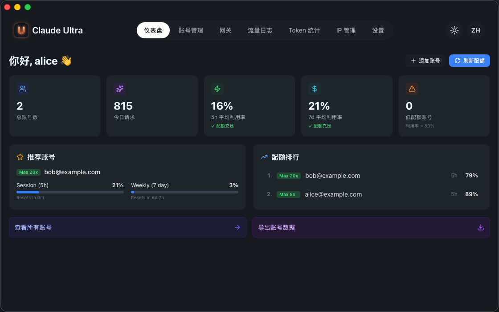
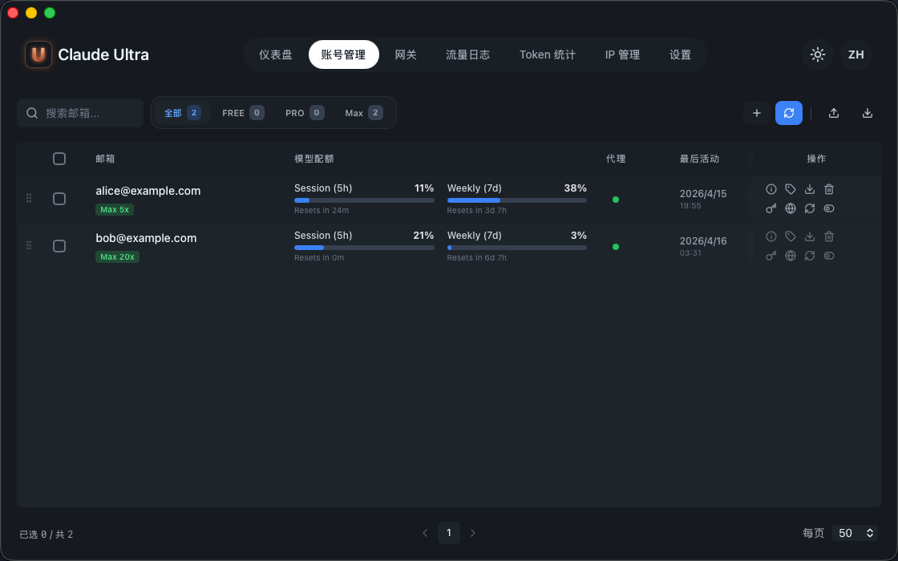
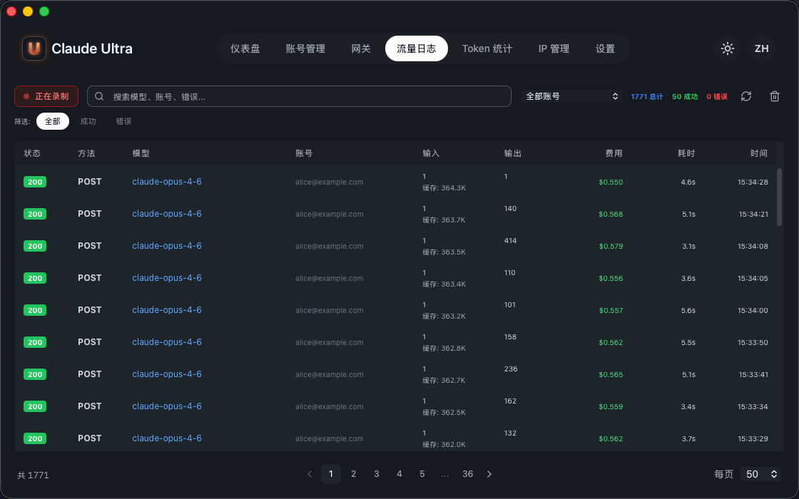

<h1 align="center">Claude Ultra</h1>

<p align="center">
  <em>Claude Code 多账号管理器 — 本地 API 网关，自动轮换账号。</em>
</p>

<p align="center">
  <a href="https://github.com/hatawong/claude-ultra/releases"></a>
  <a href="https://github.com/hatawong/claude-ultra/blob/main/LICENSE"></a>
  <a href="https://github.com/hatawong/claude-ultra/stargazers"></a>
  <a href="https://github.com/hatawong/claude-ultra/issues"></a>
  
  
</p>

<p align="center">
  <a href="README.md">English</a> | <strong>中文</strong>
</p>

<p align="center">
  
</p>

---

## 简介

Claude Ultra 是一个 macOS 桌面应用，通过本地 API 网关管理多个 Claude Code 账号。在 Claude Code 的 `settings.json` 中将 API 端点指向 `localhost`，剩下的交给 Claude Ultra：账号选择、配额追踪、自动故障转移、住宅代理轮换。

## 功能

| 功能 | 说明 |
|------|------|
| **本地 API 网关** | `localhost:9000` 透明 HTTP 代理 — Claude Code 像直连 `api.anthropic.com` 一样使用 |
| **多账号池** | 添加多个 Claude 账号，按配额可用性自动轮换 |
| **配额监控** | 实时追踪每个账号的 5 小时 Session 和 7 天周配额 |
| **自动故障转移** | 一个账号请求失败？自动切换到下一个可用账号重试 |
| **住宅代理** | IPRoyal 代理池，每会话固定 IP，自动轮换（[配置指南](docs/proxy-setup_zh.md)） |
| **流量日志** | 完整请求/响应日志，含模型、Token 数、费用、延迟 |
| **GitHub 登录** | 通过 GitHub OAuth Device Flow 认证 |
| **订阅等级** | Free / Pro / Max / Ultra，不同并发账号上限 |
| **12 种语言** | English, 简体中文, 繁體中文, 日本語, 한국어, العربية, Español, Português, Русский, Türkçe, Tiếng Việt, Bahasa Melayu |

<p align="center">
  
</p>

## 下载安装

### 下载

从 [GitHub Releases](https://github.com/hatawong/claude-ultra/releases) 下载最新 `.dmg`。

| 平台 | 文件 |
|------|------|
| macOS Apple Silicon (M1/M2/M3/M4) | `Claude.Ultra_x.x.x_aarch64.dmg` |

### 安装

1. 打开 `.dmg`，将 **Claude Ultra** 拖入应用程序文件夹
2. **首次启动**：右键点击应用 → **打开**（未签名应用需要此操作一次）
3. 如果 macOS 阻止运行：前往 **系统设置 → 隐私与安全性** → 点击 **仍然允许**

### 系统要求

- macOS 12 Monterey 或更高版本
- [Google Chrome](https://www.google.com/chrome/)（用于 Web 登录自动化）
- [Bun](https://bun.sh) 运行时（`curl -fsSL https://bun.sh/install | bash`）

## 快速开始

1. 从应用程序启动 **Claude Ultra**
2. 使用 GitHub 账号**登录**（Device Flow）
3. **添加账号** — 点击 `+`，Chrome 窗口弹出，用任意方式登录 [claude.ai](https://claude.ai)
4. **配置 Claude Code** 使用本地网关 — 添加到 `~/.claude/settings.json`：

```json
{
  "env": {
    "ANTHROPIC_BASE_URL": "http://localhost:9000",
    "ANTHROPIC_API_KEY": "sk-ultra-xxxxxxxxxxxxxxxxxxxxxxxxxxxxxxxx",
    "DISABLE_TELEMETRY": "1",
    "CLAUDE_CODE_DISABLE_NONESSENTIAL_TRAFFIC": "1"
  }
}
```

> API Key 在 **设置 → 网关** 中查看。`DISABLE_TELEMETRY` 和 `CLAUDE_CODE_DISABLE_NONESSENTIAL_TRAFFIC` 防止 Claude Code 发送绕过网关的非代理请求。

5. 正常使用 Claude Code — 请求通过账号池透明代理

<p align="center">
  
</p>

## 订阅等级

| 等级 | 并发账号数 | 价格 |
|------|----------|------|
| Free | 1 | 免费 |
| Pro | 3 | — |
| Max | 10 | — |
| Ultra | 无限制 | — |

在 **设置 → 账户** 中管理订阅。

## 配置

所有配置存储在 `~/.claude-ultra/config.json`：

```json
{
  "ui": { "language": "zh", "theme": "dark" },
  "gateway": { "port": 9000, "auto_start": true },
  "proxy": {
    "residential": {
      "host": "geo.iproyal.com",
      "port": 12321,
      "username": "",
      "password": ""
    }
  }
}
```

| 路径 | 说明 |
|------|------|
| `~/.claude-ultra/config.json` | 应用配置 |
| `~/.claude-ultra/accounts/` | 账号数据（每个账号一个 JSON） |
| `~/.claude-ultra/auth.json` | GitHub OAuth 凭证 |
| `~/.claude-ultra/gateway_logs.db` | 请求日志数据库（SQLite） |

## 从源码构建

> **注意**：从源码构建**仅用于代码审查和开发贡献**。生产使用请下载官方 `.dmg`。

`http/` 目录是 **stub** — 仅保留公共 API 让项目可以编译, 但网络和校验层是故意不完整的。源码构建**无法发出真实的上游请求**。生产使用请下载官方 `.dmg`。

```bash
# 克隆并构建
git clone https://github.com/hatawong/claude-ultra.git
cd claude-ultra
bun install

# 类型检查
bunx tsc --noEmit

# Rust 检查
cd src-tauri
cargo check --lib
cargo test --test header_order

# 开发服务器（仅 UI — 网关无法代理真实请求）
cd ..
bun run tauri:dev
```

## 技术栈

| 层 | 技术 |
|----|------|
| 桌面框架 | [Tauri 2](https://tauri.app) |
| 后端 | Rust (tokio, axum, hyper, BoringSSL) |
| 前端 | React 19, TypeScript, Tailwind CSS, Ant Design |
| TLS | [BoringSSL](https://boringssl.googlesource.com/boringssl/) via [boring](https://crates.io/crates/boring) crate |
| 浏览器自动化 | [Patchright](https://github.com/Kaliiiiiiiiii-Vinyzu/patchright-nodejs) (Playwright fork) |
| 数据库 | SQLite (rusqlite) 请求日志 |
| 状态管理 | Zustand |
| 国际化 | i18next |

## 参与贡献

参见 [CONTRIBUTING.md](CONTRIBUTING.md)。

## 安全

参见 [SECURITY.md](SECURITY.md)。

## 许可证

[MIT](LICENSE)
